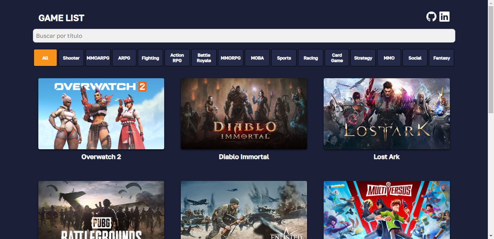

<h1 align="center">Welcome to Game List 👋</h1>
<p align="center">
  
  <a href="https://github.com/joaosmendess/Game-List#readme" target="_blank">
    
  </a>
  <a href="https://github.com/joaosmendess/Game-List/blob/main/LICENSE" target="_blank">
    
  </a>
</p>

<p align="center">
  
</p>

## 🏠 Visão Geral do Projeto
Neste projeto, desenvolvi um site chamado "Game List" utilizando a biblioteca React. O objetivo deste site é exibir uma lista de jogos, permitindo aos usuários filtrar os jogos por gênero e realizar buscas por título. 

Defini algumas constantes e estados utilizando o hook useState do React. A constante `API_BASE_URL` armazena a URL base da API que será utilizada para buscar os dados dos jogos. A constante `headers` contém um objeto com o cabeçalho da requisição HTTP, incluindo meu e-mail de desenvolvedor.

Além disso, a página possui três funções principais: `handleGenreSelect`, `handleSearch` e `handleLoadMore`. A função `handleGenreSelect` é chamada quando um gênero é selecionado no componente GenreFilter e filtra os jogos de acordo com o gênero selecionado, atualizando o estado `filteredGames`. A função `handleSearch` é chamada quando um texto é digitado no componente SearchInput e filtra os jogos de acordo com o texto digitado, atualizando o estado `filteredGames`. A função `handleLoadMore` é chamada quando o botão "Carregar Mais" é clicado e incrementa o valor de `visibleGames`, fazendo com que mais jogos sejam exibidos. A renderização do conteúdo da página é condicional, dependendo dos estados `loading` e `errorMessage`. Se o estado `loading` for verdadeiro, o componente Loader é exibido para indicar que os dados estão sendo carregados. Se o estado `errorMessage` tiver uma mensagem de erro, essa mensagem é exibida utilizando o componente ErrorMessage; caso contrário, a lista de jogos é exibida utilizando o componente GameList. <h1 align="center">Bem-vindo ao Game List 👋</h1>
<p align="center">
  
  <a href="https://github.com/joaosmendess/Game-List#readme" target="_blank">
    
  </a>
  <a href="https://github.com/joaosmendess/Game-List/blob/main/LICENSE" target="_blank">
    
  </a>
</p>

<p align="center">
  

</p>


# Documentação da API Game List

## Visão Geral
Esta API fornece dados para o site "Game List". Ela permite aos usuários obter uma lista de jogos, filtrar jogos por gênero e pesquisar jogos por título.

## URL Base
A URL base para a API é:
https://games-test-api-81e9fb0d564a.herokuapp.com/api/data/

## Headers da Requisição
O seguinte cabeçalho deve ser incluído nas suas requisições à API:

```plaintext
Endpoints
GET /api/data/
Descrição
Recupera uma lista de jogos.

Parâmetros
Nenhum

Exemplo de Requisição:
GET https://games-test-api-81e9fb0d564a.herokuapp.com/api/data/

Exemplo de Resposta:
[
  {
    "title": "Jogo 1",
    "thumbnail": "https://exemplo.com/jogo1.jpg",
    "genre": "Ação",
    "game_url": "https://exemplo.com/jogo1"
  },
  {
    "title": "Jogo 2",
    "thumbnail": "https://exemplo.com/jogo2.jpg",
    "genre": "RPG",
    "game_url": "https://exemplo.com/jogo2"
  },
  ...
]

Tratamento de Erros
Se ocorrer um erro, a API responderá com um código de status HTTP apropriado e uma mensagem de erro no corpo da resposta.

Exemplo de Resposta de Erro:
{
  "error": "Internal Server Error",
  "message": "O servidor falhou em responder, tente novamente mais tarde."
}


